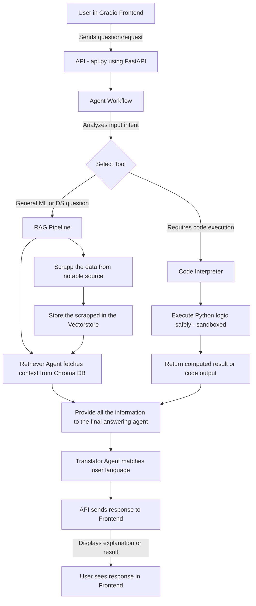

<p align="center">
 Your AI Data Science Tutor
</p>

<p align="center">
 
</p>

ML TutorBot is a multilingual, AI-powered Data Science & Machine Learning tutor. It helps users understand ML/DS concepts, libraries, and techniques in a conversational way, using Retrieval-Augmented Generation (RAG) to provide accurate, contextual answers from curated knowledge sources.

<p align="center">
  
</p>
---

## 🗺️ Road Map:
Next steps:
1. Add the initial structure ✅
2. Add the agent workflow ✅
3. Add the API logic and user interaction ✅
4. Make a simple frontend to improve the usabillity ✅
5. Add the language detector and the translator agent 🔁
6. Deploy it in Hostinger or some platform like that

---

## 🔹 Features
  * Answer ML & Data Science questions in multiple languages

  * Uses RAG to retrieve context from official documentation, tutorials, and open-access books

  * Provides clear explanations, code snippets, and examples

  * Modular agent architecture:

  * Language Detector → detects user query language

  * Retriever Agent → fetches relevant chunks from knowledge base

  * Answering Agent → generates concise answers

  * Translator Agent → ensures responses match user language

## 📜 Flow Diagram




## 📁 Repository Structure

```bash
  ML-TutorBot/
├── src/
│   ├── app/
│   │   ├── agent_workflow/        # Handles agent orchestration (Language, Retriever, Answering, Translator)
│   │   ├── api/                   # FastAPI routes and API logic
│   │   ├── core/                  # Core utilities, configs, and constants
│   │   ├── frontend/              # Gradio UI components and design
│   │   ├── rag_pipelines/         # RAG (Retrieval-Augmented Generation) logic and document retrieval flow
│   │   └── __init__.py
│   │
│   ├── data/                      # Preprocessed documents and text datasets for embeddings
│   ├── chroma/                    # Vector database storage (Chroma persistence)
│   ├── tests/                     # Unit and integration tests
│   ├── __init__.py
│   └── main.py                    # Entry point for backend execution
│
├── docker-compose.yml             # Docker multi-service setup (backend, vector DB, etc.)
├── Dockerfile                     # Container definition for ML TutorBot
├── requirements.txt               # Python dependencies
├── README.md                      # Project documentation
└── LICENSE                        # License file (if added)
```

## 📚 Knowledge Sources

  * Official Documentation: scikit-learn, Pandas, NumPy, PyTorch, TensorFlow

  * Open-Access Books: Dive into Deep Learning, fast.ai courses

  * Blogs & Tutorials: Kaggle Learn, Towards Data Science, Analytics Vidhya

  * Wikipedia (ML/DS articles)

  * All documents are chunked and embedded into a vector database for RAG.

## ⚡ Tech Stack

Language Model: Gemini 2.5 Flash Lite

Embeddings: sentence-transformers/paraphrase-multilingual-MiniLM-L12-v2

Vector Database: Chroma

Backend: FastAPI

Interface: Gradio 

## 🚀 Installation & Setup

1. Clone the repo:
  ```bash
  git clone https://github.com/Fugant1/ML-TutorBot.git
  cd ML-TutorBot
  ```
2. Run:
  ```bash
  docker compose build
  docker compose up
  python3 -m app.frontend.ui
  ```
